# Physics Tuning Guide

Flinger replaces Compose's default fling physics with the same spline-based
decay model Android's `OverScroller` uses — but with every parameter open for
tuning. This guide explains what each parameter actually does inside the
engine, with diagrams generated from the library's own math, and gives you
recipes for common scroll "feels".

All diagrams below are **computed from the real implementation**, not
hand-drawn. The curves you see are what the code produces.

---

## Table of Contents

- [The big picture](#the-big-picture)
- [The spline curve](#the-spline-curve)
- [Parameter reference](#parameter-reference)
  - [scrollViewFriction](#scrollviewfriction)
  - [decelerationFriction](#decelerationfriction)
  - [gravitationalForce](#gravitationalforce)
  - [decelerationRate](#decelerationrate)
  - [inchesPerMeter](#inchespermeter)
  - [absVelocityThreshold](#absvelocitythreshold)
  - [splineInflection](#splineinflection)
  - [splineStartTension](#splinestarttension)
  - [splineEndTension](#splineendtension)
  - [numberOfSplinePoints](#numberofsplinepoints)
- [How parameters interact](#how-parameters-interact)
- [Tuning recipes](#tuning-recipes)
- [Troubleshooting](#troubleshooting)
- [Regenerating the diagrams](#regenerating-the-diagrams)

---

## The big picture

When the user lifts their finger, Flinger turns the release velocity into a
complete trajectory **up front** — duration and total distance are decided
before the first frame is drawn. Each animation frame then just looks up
"how far along the trajectory should I be at time t?"

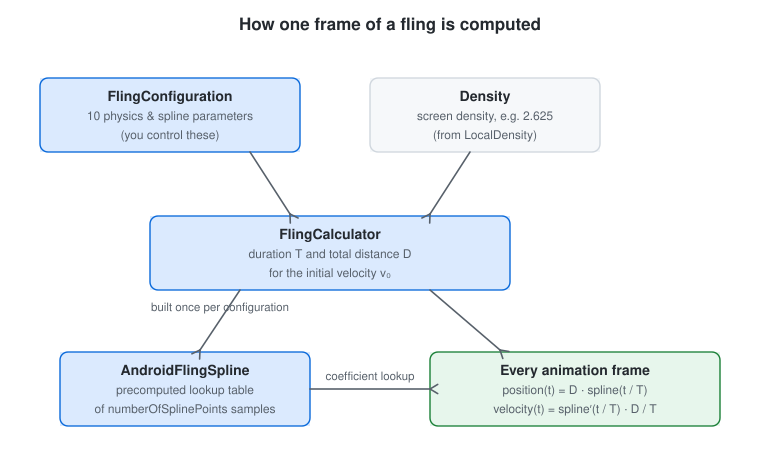

Concretely, a fling with release velocity `v₀` is summarized by three numbers:

**1. A physical friction coefficient** — combines gravity, screen density and
the deceleration friction into one number (this mirrors the
`PHYSICAL_COEF` in Android's `Scroller`):

```
physicalCoef = gravitationalForce · inchesPerMeter · density · 160 · decelerationFriction
```

**2. A deceleration exponent** `l` — how quickly the fling loses speed,
relative to the release velocity:

```
l = ln( splineInflection · |v₀| / (scrollViewFriction · physicalCoef) )
```

**3. Duration `T` and total distance `D`** of the whole fling:

```
T = 1000 · e^( l / (decelerationRate − 1) )          (milliseconds)
D = scrollViewFriction · physicalCoef · e^( decelerationRate / (decelerationRate − 1) · l )
```

From that point on, the normalized spline curve (see
[the next section](#the-spline-curve)) stretches over `T` milliseconds and `D`
pixels, so the actual on-screen position at time `t` is
`position(t) = D · spline(t / T)`.

Here is what a single default fling looks like in practice — released at
8000 px/s on a 420 dpi screen. Note that the velocity (orange) decays
**monotonically** from the very first frame: a fling never speeds up.
What changes over time is only how quickly it bleeds speed:

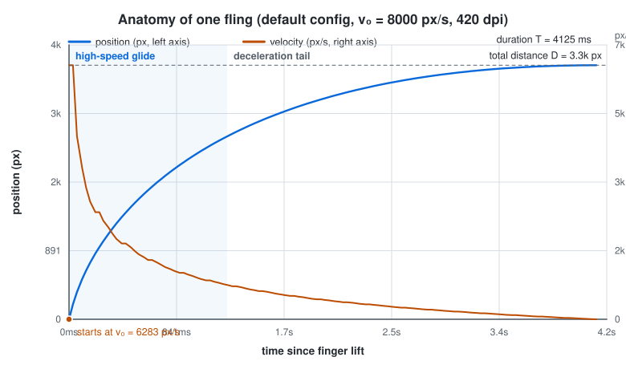

The whole trajectory is deterministic: same velocity, same configuration,
same stopping point. That is why tuning Flinger is really about tuning the
*shape* of this curve.

---

## The spline curve

The normalized spline is a single ease-out curve from `(0, 0)` to `(1, 1)`.
Its initial slope matches the release velocity, and it flattens out as the
scroll comes to rest — the classic "fast start, long tail" fling feel.

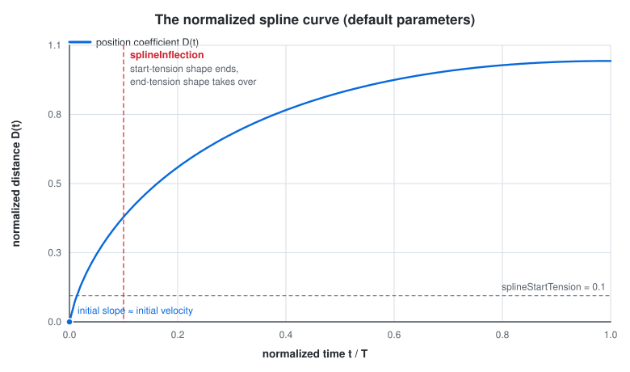

The curve is built once per configuration as a lookup table of
`numberOfSplinePoints` samples (see `SplineUtils.computeSplineInfo`). Its
shape is controlled by three parameters that work like the two tension
handles and an anchor of a Bézier-style curve:

| Parameter | What it shapes |
|:----------|:---------------|
| `splineStartTension` | curvature of the **early** part of the curve |
| `splineEndTension` | curvature of the **late** part of the curve |
| `splineInflection` | **where** early hands over to late (and, separately, enters the `l` formula above — it has a physical effect too, not just a visual one) |

Internally the two control points handed to the curve builder are
`splineP1 = splineStartTension · splineInflection` and
`splineP2 = 1 − splineEndTension · (1 − splineInflection)`, so the three
parameters are not fully independent — raising the inflection also moves both
control points.

---

## Parameter reference

### scrollViewFriction

Resistance applied while computing the fling trajectory. It appears **twice**
in the math — inside the exponent `l` and as a multiplier of the distance —
which makes it the single most effective knob for "how far does one fling
travel?" Lower friction means a fling of the same release velocity travels
farther and lasts longer.

| Property | Value |
|:---------|:------|
| **Default** | `0.008` |
| **Sensible range** | `0.001` – `0.1` |
| **Unit** | dimensionless coefficient |

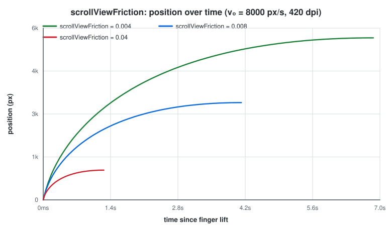

| Value | Measured effect (v₀ = 8000 px/s, 420 dpi) | Feels like |
|:------|:------------------------------------------|:-----------|
| `0.004` | T ≈ 6.9 s, D ≈ 5 500 px | slippery, long glides |
| `0.008` (default) | T ≈ 4.1 s, D ≈ 3 300 px | balanced |
| `0.04` | T ≈ 1.3 s, D ≈ 1 000 px | controlled, stops quickly |

```kotlin
// Long, floaty scrolls for a photo gallery
FlingConfiguration.Builder()
    .scrollViewFriction(0.004f)
    .build()

// Quick-stop for a settings menu
FlingConfiguration.Builder()
    .scrollViewFriction(0.05f)
    .build()
```

---

### decelerationFriction

Friction folded into the physical coefficient. Unlike `scrollViewFriction`,
it scales the coefficient *linearly* — halving it roughly halves the distance
and, more visibly, changes how abruptly the tail of the fling dies out. This
is the best knob for "how gently does the scroll land?"

| Property | Value |
|:---------|:------|
| **Default** | `0.09` |
| **Sensible range** | `0.01` – `1.0` |
| **Unit** | dimensionless coefficient |

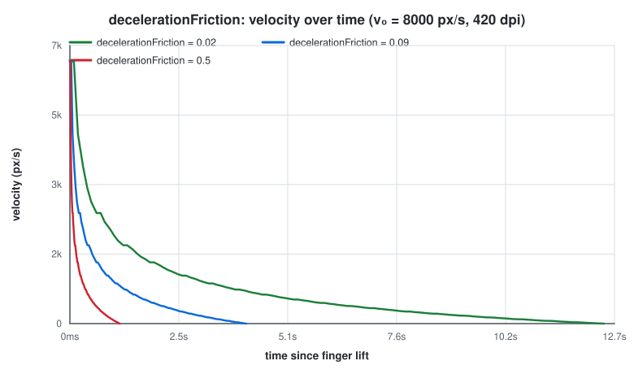

| Value | Measured effect (v₀ = 8000 px/s, 420 dpi) | Feels like |
|:------|:------------------------------------------|:-----------|
| `0.02` | T ≈ 12.5 s, D ≈ 10 000 px | gradual, premium glide |
| `0.09` (default) | T ≈ 4.1 s, D ≈ 3 300 px | natural |
| `0.5` | T ≈ 1.2 s, D ≈ 930 px | abrupt, decisive stop |

```kotlin
// Ultra-smooth premium feel
FlingConfiguration.Builder()
    .decelerationFriction(0.02f)
    .build()
```

Because `decelerationFriction` lives inside the same physical coefficient as
`gravitationalForce` and screen density, the *absolute* effect of this
parameter depends on the device — a low-density screen gets a physically
shorter fling from the same value. That is intentional: it is what keeps the
feel consistent with real-world physical units.

---

### gravitationalForce

Simulated gravity in m/s². It is one of the multipliers of the physical
coefficient, so raising it makes every fling shorter and heavier — exactly
like the scroll surface having "more gravity".

| Property | Value |
|:---------|:------|
| **Default** | `9.80665` (Earth) |
| **Sensible range** | `1.0` – `20.0` |
| **Unit** | m/s² |

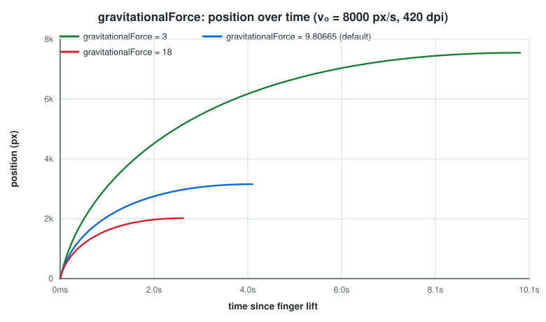

| Value | Feels like |
|:------|:-----------|
| `1` – `5` | moon gravity — floaty, dreamy UIs |
| `9.8` (default) | Earth-like physics |
| `15` – `20` | heavy gravity — grounded, serious UIs |

```kotlin
// Floaty, low-gravity feel
FlingConfiguration.Builder()
    .gravitationalForce(3.0f)
    .build()
```

---

### decelerationRate

The exponential rate in both the duration and distance formulas. It controls
the **shape of the decay**: values close to 1 stretch the tail enormously
(the fling technically runs for a very long time at very low speed), while
high values kill the fling early.

| Property | Value |
|:---------|:------|
| **Default** | `ln(0.78) / ln(0.9) ≈ 2.358` |
| **Sensible range** | `1.5` – `5.0` |
| **Unit** | exponential coefficient |

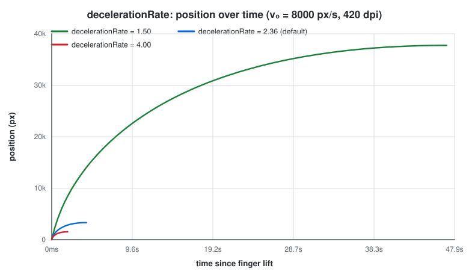

| Value | Measured effect (v₀ = 8000 px/s, 420 dpi) | Feels like |
|:------|:------------------------------------------|:-----------|
| `1.5` | T ≈ 47 s (!), D ≈ 37 600 px | near-endless momentum |
| `2.358` (default) | T ≈ 4.1 s, D ≈ 3 300 px | natural |
| `4.0` | T ≈ 1.9 s, D ≈ 1 500 px | rapid stop |

```kotlin
// Extended momentum for content discovery
FlingConfiguration.Builder()
    .decelerationRate(1.5f)
    .build()
```

The default is the same value Android's `Scroller` uses: it comes from the
observation that a fling should lose 78% of its velocity over the time in
which a "90% decay" reference fling loses 10%.

> **Careful:** because `T` grows *exponentially* as the rate approaches 1,
> values below ~1.5 produce flings that nominally run for tens of seconds.
> The motion is imperceptible near the end, but the animation keeps the list
> busy — pair low rates with `absVelocityThreshold` to cut the tail off.

---

### inchesPerMeter

The physical conversion factor between screen density and real-world units
(1 m = 39.37 in). It is a constant of the physical model, not a tuning knob.

| Property | Value |
|:---------|:------|
| **Default** | `39.37` |
| **Range** | fixed constant |
| **Unit** | inches per meter |

Leave it alone unless you are deliberately distorting the physical model
(for example, simulating a "bigger world" on the same screen).

---

### absVelocityThreshold

The velocity (in px/s) below which an animation is considered finished. The
default `0` means a fling always plays out to the end; a positive value
terminates the animation as soon as its residual speed drops under the
threshold.

This is the cleanest way to prevent the near-invisible "tail" of long flings
(from low `decelerationRate` or low frictions) from blocking new gestures,
and to ignore tiny accidental swipes entirely.

| Property | Value |
|:---------|:------|
| **Default** | `0` |
| **Sensible range** | `0` – `100` |
| **Unit** | pixels / second |

```kotlin
// Require intentional swipes, cut off slow tails
FlingConfiguration.Builder()
    .absVelocityThreshold(50f)
    .build()
```

---

### splineInflection

The point where the start-tension part of the spline hands over to the
end-tension part. Visually it shifts *when* the curve commits to decelerating:

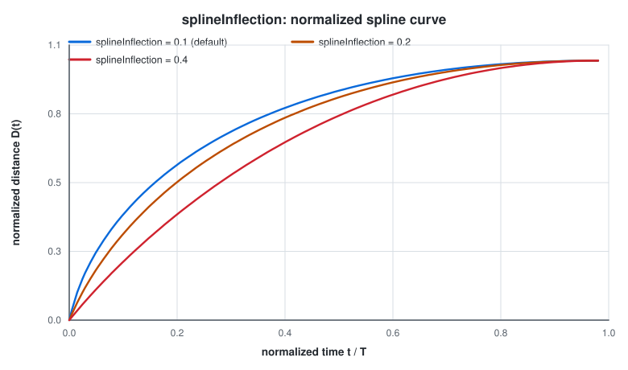

It also appears directly in the exponent `l`, so changing it changes fling
**distance and duration too**, not just the curve shape. This is the parameter
most people get surprised by: raising the inflection makes flings *shorter*
at equal release velocity, because it pushes `l` down.

| Property | Value |
|:---------|:------|
| **Default** | `0.1` |
| **Sensible range** | `0.01` – `0.5` |
| **Unit** | normalized position (0–1) |

| Value | Feels like |
|:------|:-----------|
| `0.01` – `0.08` | quick hand-over, mostly deceleration curve — snappy |
| `0.1` (default) | the Android-native balance |
| `0.2` – `0.5` | extended early curve, distinctly different feel — playful |

```kotlin
// Distinct, bouncy curve signature
FlingConfiguration.Builder()
    .splineInflection(0.4f)
    .build()
```

---

### splineStartTension

Curvature of the early portion of the spline. Higher values pull the early
curve flatter before speed picks up, lower values keep the start of the curve
tight and straight. (Recall the control point is
`startTension · inflection`.)

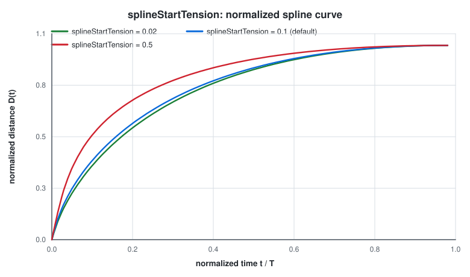

| Property | Value |
|:---------|:------|
| **Default** | `0.1` |
| **Sensible range** | `0.01` – `1.0` |
| **Unit** | tension coefficient |

| Value | Feels like |
|:------|:-----------|
| `0.01` – `0.05` | gentle, refined launch |
| `0.1` (default) | Android-native |
| `0.3` – `1.0` | eager, energetic launch |

---

### splineEndTension

Curvature of the late portion of the spline — how the scroll "lands".
Lower values stretch a long, soft landing; higher values bring the curve
down decisively.

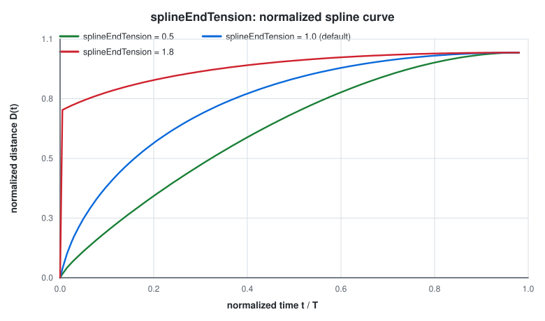

| Property | Value |
|:---------|:------|
| **Default** | `1.0` |
| **Sensible range** | `0.1` – `2.0` |
| **Unit** | tension coefficient |

| Value | Feels like |
|:------|:-----------|
| `0.1` – `0.5` | extended, gradual landing — premium |
| `1.0` (default) | Android-native landing |
| `1.5` – `2.0` | quick, decisive landing — precise positioning |

```kotlin
// Smooth, gradual landing
FlingConfiguration.Builder()
    .splineEndTension(0.5f)
    .build()
```

---

### numberOfSplinePoints

Resolution of the precomputed spline lookup table. The spline is sampled once
and linearly interpolated between samples; this parameter is the sample count.

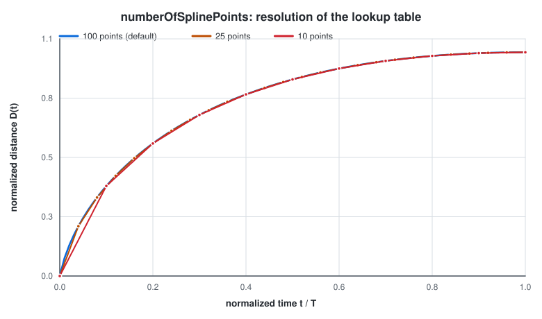

At the default `100` the linear interpolation error is already visually
imperceptible. Lower values are marginally cheaper to build (the table is
computed once per configuration, not per frame), so this is **not** a
smoothness knob in practice — it only matters if you change spline parameters
frequently at runtime.

| Property | Value |
|:---------|:------|
| **Default** | `100` |
| **Sensible range** | `50` – `500` |
| **Unit** | sample points |

---

## How parameters interact

Two things are worth internalizing before tuning, because they explain most
surprises:

1. **Both frictions live in one product.**
   `scrollViewFriction · decelerationFriction · gravitationalForce · density`
   all multiply into the physical coefficient, and `scrollViewFriction` appears
   once more inside the exponent. If you lower one friction and see a much
   bigger change than expected, check whether the other friction is also
   amplifying it.

2. **`splineInflection` does double duty.** It shapes the spline *and* scales
   fling distance/duration through `l`. If you only want a visual curve
   change without changing how far flings travel, compensate by adjusting
   `scrollViewFriction` alongside it.

A quick reference, all measured at v₀ = 8000 px/s and 420 dpi (default
configuration otherwise):

| Change | Duration | Distance |
|:-------|:---------|:---------|
| default | ≈ 4.1 s | ≈ 3 300 px |
| `scrollViewFriction` 0.008 → 0.004 | × 1.7 longer | × 1.7 farther |
| `scrollViewFriction` 0.008 → 0.04 | ÷ 3.3 shorter | ÷ 3.3 shorter |
| `decelerationFriction` 0.09 → 0.02 | × 3 longer | × 3 farther |
| `decelerationFriction` 0.09 → 0.5 | ÷ 3.5 shorter | ÷ 3.5 shorter |
| `decelerationRate` 2.36 → 1.5 | × 11 longer | × 11 farther |
| `decelerationRate` 2.36 → 4.0 | ÷ 2.2 shorter | ÷ 2.2 shorter |

---

## Tuning recipes

Complete configurations for common use cases. For ready-made behaviors you
can drop straight into a composable, also see
[FlingPresets](../flinger/src/main/java/io/iamjosephmj/flinger/behaviours/FlingPresets.kt)
(`FlingPresets.smooth()`, `FlingPresets.iOSStyle()`, `FlingPresets.floaty()`,
`FlingPresets.quickStop()`, `FlingPresets.bouncy()`, `FlingPresets.ultraSmooth()`,
…).

### iOS-style scroll

Higher friction with controlled momentum:

```kotlin
FlingConfiguration.Builder()
    .scrollViewFriction(0.04f)   // same as FlingPresets.iOSStyle()
    .build()
```

### Photo gallery (floaty)

Long, gliding scrolls for visual content:

```kotlin
FlingConfiguration.Builder()
    .scrollViewFriction(0.006f)
    .decelerationFriction(0.015f)
    .gravitationalForce(7.0f)
    .absVelocityThreshold(2f)    // trim the very slow tail
    .build()
```

### Quick selection (snappy)

Fast, responsive scrolling for lists that need precise selection:

```kotlin
FlingConfiguration.Builder()
    .scrollViewFriction(0.03f)
    .decelerationFriction(0.3f)
    .splineInflection(0.08f)
    .absVelocityThreshold(20f)
    .build()
```

### Bouncy / playful

An unusual curve signature for games and playful UIs:

```kotlin
FlingConfiguration.Builder()
    .decelerationFriction(0.6f)
    .splineInflection(0.4f)
    .splineStartTension(0.3f)
    .build()
```

### Ultra-premium

Buttery smooth scrolling with a soft landing:

```kotlin
FlingConfiguration.Builder()
    .scrollViewFriction(0.006f)
    .decelerationFriction(0.05f)
    .splineEndTension(0.7f)
    .numberOfSplinePoints(150)
    .build()
```

### Accessibility / reduced motion

Minimal, controlled scrolling. Note that Flinger also ships
system-aware presets (`FlingPresets.accessibilityAware()`,
`FlingPresets.reducedMotion()`) that respect the device's reduce-motion
settings:

```kotlin
FlingConfiguration.Builder()
    .scrollViewFriction(0.08f)
    .decelerationFriction(0.5f)
    .absVelocityThreshold(30f)
    .build()
```

---

## Troubleshooting

**Scroll feels too slow / heavy**
- Decrease `scrollViewFriction` (try 0.004–0.006)
- Decrease `decelerationFriction` (try 0.02–0.05)
- Decrease `gravitationalForce` (try 5.0–7.0)

**Scroll feels too slippery / uncontrolled**
- Increase `scrollViewFriction` (try 0.03–0.05)
- Increase `decelerationFriction` (try 0.15–0.3)
- Set `absVelocityThreshold` to filter accidental swipes

**Scroll stops too abruptly**
- Decrease `decelerationFriction` (try 0.02–0.05)
- Decrease `splineEndTension` (try 0.5–0.7)
- Decrease `splineInflection` (try 0.05–0.08) — and note this *also* lengthens
  flings via the exponent

**Fling animation lingers after motion is invisible**
- Increase `absVelocityThreshold` (try 20–50) to end the animation early
- Raise `decelerationRate` (values close to 1 create very long tails)

**Scroll start feels wrong**
- Adjust `splineStartTension`: lower for a gentler start, higher for a more
  eager one
- Adjust `splineInflection` to move the point where deceleration takes over

**Animation looks choppy**
- Choppy flings are almost never a spline-resolution problem — check frame
  rate and how often the configuration (and therefore the lookup table) is
  rebuilt. `numberOfSplinePoints` only affects one-time table construction.

---

## Regenerating the diagrams

Every diagram in this document is produced by
[`docs/tools/generate_diagrams.py`](tools/generate_diagrams.py), a
dependency-free Python script that ports `SplineUtils`, `AndroidFlingSpline`
and `FlingCalculator` and plots their real output:

```bash
python3 docs/tools/generate_diagrams.py
```

If you change the physics engine, regenerate so the documentation stays
honest.

---

## Further Reading

- [Main README](../README.md) — quick start and usage examples
- [FlingPresets.kt](../flinger/src/main/java/io/iamjosephmj/flinger/behaviours/FlingPresets.kt) — pre-built configurations
- [FlingCalculator.kt](../flinger/src/main/java/io/iamjosephmj/flinger/flings/FlingCalculator.kt) — duration/distance math
- [AndroidFlingSpline.kt](../flinger/src/main/java/io/iamjosephmj/flinger/spline/AndroidFlingSpline.kt) — the spline lookup
- [Android OverScroller](https://developer.android.com/reference/android/widget/OverScroller) — the native implementation that inspired this library
